# 目次
-[本文の趣旨](#本文の趣旨)

-[シスコパケットトレーサー画面の見方](#シスコパケットトレーサー画面の見方)

-[デバイスを用意する](#デバイスを用意する)

-[L3/L2スイッチの設置](#l3l2スイッチの設置)

# 本文の趣旨
これは私の個人的なメモであり、必ずしも本文に書いてある内容が正しいとは限らない。

参考にすることは構わないが、参考にする際は事実であるかを確認し、注意をすること。


# シスコパケットトレーサー画面の見方
次の画像がパケットトレーサーの画面である。
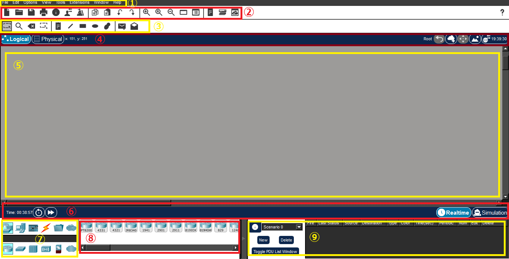

各パネルを以下のように定義して、説明を行う。

1:メニューバー

2:メインツールバー

3:コモンツールバー

4:論理・物理ナビゲーションバー

5:ワークスペース

6:タイムバー

7:デバイス種類選択ボックス

8:デバイス選択ボックス

9:パケットウィンドウ

# デバイスを用意する

## L3/L2スイッチの設置

デバイス種類選択ボックス1段目の一番左にある[Network Device]を左クリックする。


デバイス種類選択2段目の左から二番目にある[Switches]を左クリックする。


デバイス選択ボックスから[3650 24PS]を左クリック。

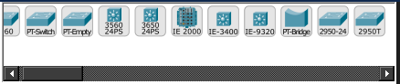

その状態でワークスペースを左クリックすることにより[3650 24PS]をワークスペースに配置する。

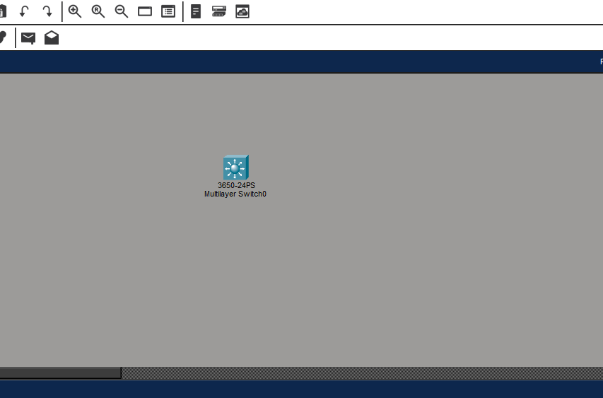

配置した[3650 24PS]を左クリックすると次のようなウインドウが表示される。

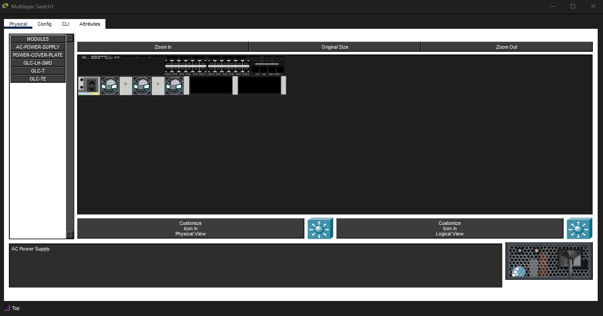

現在の状態だと、[3650 24PS]は電源供給がされていない状態なので、電源を配置する。

[AC-POWER-SUPPLY]が左側に表示されていることを確認する。

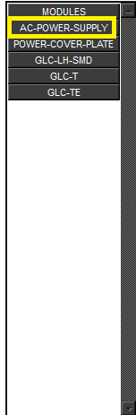

また、機器の画面に黒い領域があることを確認する。

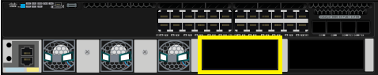

[AC-POWER-SUPPLY]を機器の画面の黒い領域へとドラッグアンドドロップする。

そうすると黒い領域に新しく、機器が設置されているのを確認する。

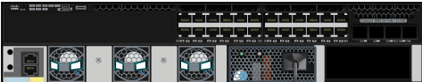

## PCの設置
スイッチに対してコンソール接続をし、スイッチの設定をするためのPCを用意する。

デバイス種類選択ボックス1段目の左から二番目にある[End Device]を左クリックする。


デバイス種類選択ボックス2段目の一番左にある[End Device]を左クリックする。


デバイス選択ボックスから[PC]を左クリック。

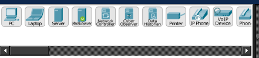

その状態でワークスペースを左クリックすることにより[PC]をワークスペースに配置する。

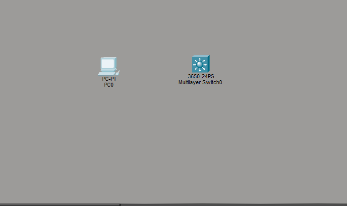

## PCとスイッチをコンソール接続する

デバイス種類選択ボックス1段目の左から四番目にある[Connections]を左クリックする。


デバイス種類選択ボックス2段目の一番左にある[Connections]を左クリックする。


デバイス選択ボックス左から二番目の青い弧を描いている線を左クリックする。

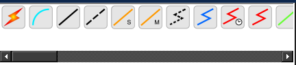

その状態でワークスペース内の[PC]を左クリックすると次のようなメニューがポップアップする。

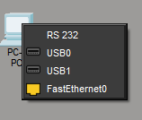

[RS23]を左クリックし、ワークスペース内の[3650 24PS]を左クリックすると次のようなメニューがポップアップする。

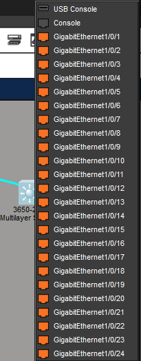

[console]を左クリックし、ワークスペース上のオブジェクトが次の画像のようになっていることを確認する。

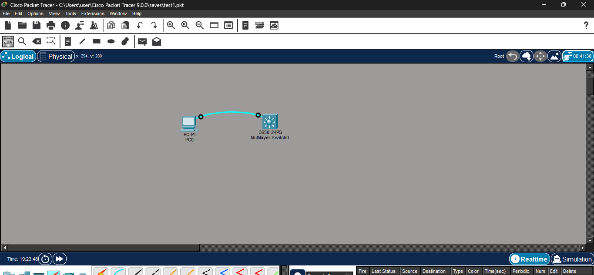

# スイッチの設定を行う
デバイスを配置できたので次はPCのターミナルからスイッチの設定を行う。

## ターミナル画面へと遷移する

PCとスイッチがコンソール接続されているので、PCのターミナル画面に遷移する。

[PC]を左クリックすると次のようなウインドウがポップアップされる。

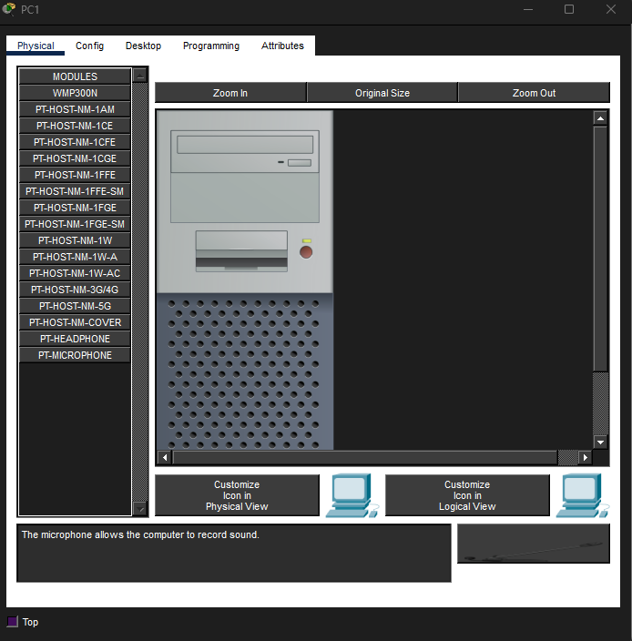

上部タブから[desktop]を左クリックする。そうすると次のような画面になる。

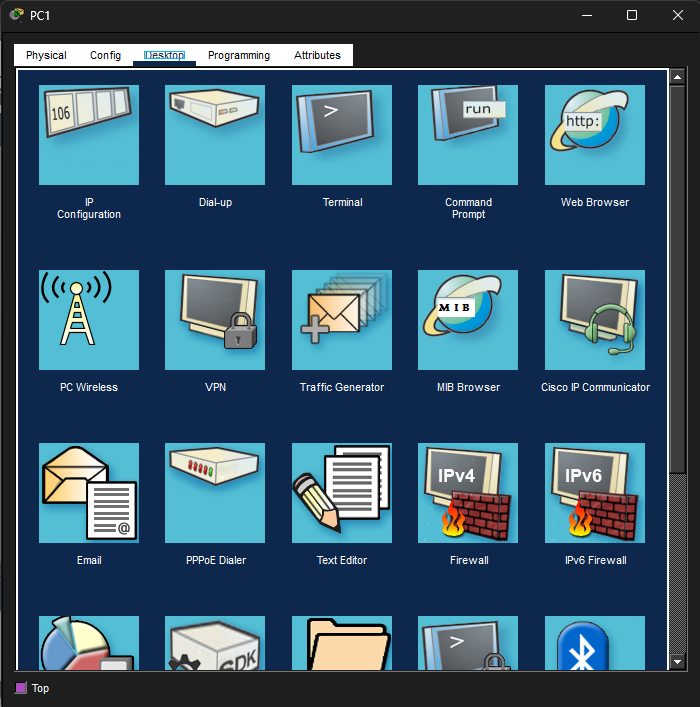

[Terminal]を左クリックする。

次のような画面になるので、設定はそのままで[OK]を左クリックする。

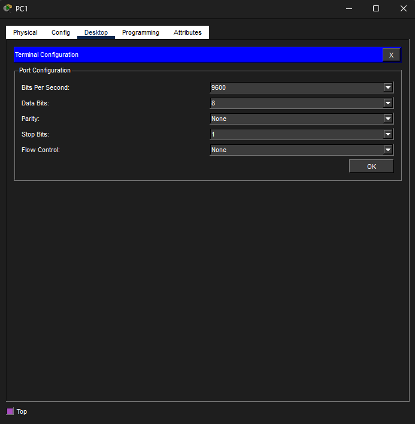

次のような画面になるのを確認する。


## 基本的なコマンドを試してみる
### 最初に
最初の画面で
```
Would you like to enter the initial configuration dialog? [yes/no]:
```
という表示が出てくる。yesと打つと対話形式による簡単な初期設定を行えるが今回はnoと打つ
```
Would you like to enter the initial configuration dialog? [yes/no]: no
```
そうすると
```
Press RETURN to get started!
```
と表示されるのでENTERキーを入力する。そうすると
```
Switch>
```
というようにCLIを受け付けるようになる。
簡単なコマンドをいくつか打ち込んでみる。[show version]コマンドでスイッチのバージョン情報を表示させる。
```
Switch>show version
```
これによってスイッチの情報が表示される。今回はあくまでテストなのでそれらしい内容が表示されていれば問題ない。
```
% Invalid input detected at '^' marker.
```
のようなエラー文が出る場合はスペルミスがないかを確認し再度実行する。

### 特権EXECモードに移行する
特定のコマンドを打ち込むためには該当する権限モードである必要性がある。

例えばスイッチのコンフィグ情報を閲覧するための[show running-config]コマンドでは特権EXECモードである必要性がある。

現在はユーザーEXECモードなのでそこから特権EXECモードに移行する場合[enable]コマンドを実行する。

```
Switch>enable
```
これを実行すると以下のようにCLIの表記が変わる
```
Switch#
```
次に[show running-config]コマンドを実行する。
```
Switch#show running-config
```
そうすると以下のように出てくる。
```
Switch#show running-config
Building configuration...

Current configuration : 1354 bytes
!
(省略)
!
line con 0
!
line aux 0
!
line vty 0 4
 login
!
!
!
!
end
```
[show running-config]コマンドは特権EXECモードでしか実行できないので上記のようになっていれば特権EXECモードに移行できている証拠。もちろんCLIの>が#に変わっていることで確認もできる。
### グローバルコンフィギュレーションモードに移行する
特権EXECモードからグローバルコンフィギュレーションモードに移行する。グローバルコンフィギュレーションモードでは機器全般にかかわる設定を行うことが可能である。
```
Switch#configure terminal
```
このコマンドを打つことによりCLIが
```
Switch(config)#
```
このような表記に変わる[(config)#]となっていればグローバルコンフィギュレーションモードで実行されている証拠となる。
### ラインコンフィギュレーションモードに移行する
グローバルコンフィギュレーションモードからラインコンフィギュレーションモードへと移行する。

ラインコンフィギュレーションモードではコンソールなどの設定が可能である。

次のコマンドを打つ。
```
Switch(config)#line console 0
```
このコマンドを打つと次のようにCLIが変わる。
```
Switch(config-line)#
```
[(config-line)#]となっていればラインコンフィギュレーションモードで実行されている証拠である。
## 学習を円滑に進めるための設定
学習を円滑に進めるためにコンソールのタイムアウト設定を変更する。学習時はコンソール接続したまま調べたりするので、コンソールを放置する時間が長くなり、その間にタイムアウトしてしまうことが多い。なので、タイムアウトの時間を30分に変更する。

タイムアウトの時間を設定するためにはラインコンフィギュレーションモードで[exec-timeout <分> <秒>]を打ち込む。
```
Switch(config-line)#exec-timeout 30
```
これによりタイムアウト時間が30分に変更される。

## セキュリティ設定
### コンソールパスワードを設定する
コンソール接続した際に、パスワードを求めるようにする設定を行う。
ラインコンフィギュレーションモードに移行した後、[password]コマンドでパスワードを設定する。
今回は[pswconsole]をパスワードとする。
```
Switch(config)#line console 0
Switch(config-line)#password pswconsole
Switch(config-line)#login
```

これによりパスワードは[pswconsole]となった、もちろんパスワードを[hoge]にしたければ[password hoge]のようにすればよい。

[login]コマンドを実行しないとログインを求めることができないので気を付けること。
変更が設定されているか確認するため、特権EXECモードに戻り[show running-config]を実行する。
```
Switch#show running-config
(省略)
line con 0
 password pswconsole
 login
 (省略)
```
このようになっていれば反映されている。
[running-config]の設定を[startup-config]に上書きするために次のコマンドを実行する
```
Switch#copy running-config startup-config 
```
これを実行すると[Destination filename [startup-config]?]と聞かれるのでENTERキーを入力する。そうすると以下のようになる。
```
Destination filename [startup-config]? 
Building configuration...
[OK]
Switch#
```
これで設定が完了した。
### enableパスワードを設定する
ユーザーEXECモードから特権EXECモードに移行する際にパスワードを求めるよう設定する。

今回のパスワードは[pswenable]にする。
```
Switch(config)#enable password pswenable
```
この時点では[running-config]上では設定できた。[startup-config]でも反映させるためにコピーする。
```
Switch#copy running-config startup-config 
Destination filename [startup-config]? 
Building configuration...
[OK]
Switch#
```
### ユーザーアカウントを作成する
ログインの際にユーザー名とパスワードを求めるようなローカル認証の設定をする。

今回は管理者ユーザーと一般ユーザーを作成する。
#### 管理者ユーザーの作成
管理者ユーザーを作成する。ユーザー名やパスワードは何でもよいが、今回はユーザー名を[admin]パスワードを[pswadmin]とする。

ユーザーを作成する際は[username <ユーザー名> privilege <権限レベル> password <パスワード>]を入力する。

privilegeは権限レベルを表しており、値が低いほど権限が少なく、値が高いほど権限が高い。

最小値は0であり、最大値は15である。つまり15で設定すれば最高権限を持ったユーザーを作成できる。
```
Switch(config)#username admin privilege 15 password pswadmin
```
次に、ログイン方法をローカルに設定する。
ラインコンフィギュレーションモードに移行し、[login local]コマンドを実行する。
```
Switch(config-line)#login local
```
これで、一度ログアウトコマンドを実行してみる。
```
Switch(config-line)#exit
Switch(config)#exit
Switch#
%SYS-5-CONFIG_I: Configured from console by console

Switch#logout
```
ログアウトし、エンターキーを押すと次のようになる
```
User Access Verification

Username: 
```
前までの設定だったらパスワードを求められていたが、今回はユーザーネームを求められる。
```
Username: admin
Password: 

Switch#
```
ユーザーネームとパスワードを入力し、ログインできる。

権限レベル15のユーザーでログインしたら最初から特権EXECモードで始まる。

### 通常ユーザーの作成
通常ユーザーを作成する。ユーザー名やパスワードは何でもよいが、今回はユーザー名を[user]パスワードを[pswuser]とする。

権限レベルは1にする
```
Switch(config)#username user privilege 1 password pswuser
```
ログアウトし、作成したユーザーでログインできることを確認する。
```
Username: user
Password: 

Switch>
```
userでログインすると上記のようになる。特権レベルを1とするとユーザーEXECモードから始まる。

### パスワードの暗号化
管理者でログインし、[show running-config]を実行してみる。
```
(省略)
!
username admin privilege 15 password 0 pswadmin
username user password 0 pswuser
!
(省略)
```
このように[running-config]内ではパスワードが丸見えであるので暗号化して、セキュリティを高める必要性がある。

#### イネーブルパスワードの暗号化
イネーブルパスワードを暗号化するにはグローバルコンフィギュレーションモードで[enable secret <パスワード>]を実行する。
```
Switch(config)#enable secret pswenable
```
これで暗号化されているか[show running-config]で確かめる。
```
(省略)
!
no profinet
enable secret 5 $1$mERr$eNyIgpj6/yOAgY/cP5LtU/
enable password pswenable
!
(省略)
```
結果を見るとこのようになっていた。前回設定したパスワード設定が残っているので次のようにコマンドを実行する。
```
Switch(config)#no enable password 

```
再度[running-config]を見ると次のようになっている
```
(省略)
!
no profinet
enable secret 5 $1$mERr$eNyIgpj6/yOAgY/cP5LtU/
!
(省略)
```
これにより、イネーブルパスワードがプレーンな状態で保存されないことを確認できた。
#### イネーブルパスワード以外の暗号化
イネーブルパスワード以外のパスワードはグローバルコンフィギュレーションモードで[service pssword-encryption]を実行することにより可能である。

```
Switch(config)#service password-encryption
```
[running-config]を確認すると次のようになっている
```
(省略)
!
username admin privilege 15 password 7 08315F59081D081E1C
username user password 7 08315F591C0A0005
!
(省略)
```
これでイネーブルパスワード以外も暗号化されていることが確認できた。
# 簡単なネットワークを構築する
スイッチのインターフェイス二つにそれぞれ一台ずつパソコンを繋ぎ、疎通確認を行う。
## インターフェイスの設定
インターフェイスの設定を行う前に機器にどのようなインターフェイスがあるのかを確認する。

[running-config]を見ると次のような文字列を確認できる。
```
(省略)
!
interface GigabitEthernet1/0/1
!
interface GigabitEthernet1/0/2
!
interface GigabitEthernet1/0/3
!
interface GigabitEthernet1/0/4
!
interface GigabitEthernet1/0/5
!
(省略)
```
このように[running-config]からどのようなインターフェイスがあるのかを確認できる。
#### 豆知識
ちなみに、パイプによってデータを渡すこともできる。
```
Switch#show running-config | section interface
```
結果は次のようになる。
```
interface GigabitEthernet1/0/1
interface GigabitEthernet1/0/2
interface GigabitEthernet1/0/3
interface GigabitEthernet1/0/4
interface GigabitEthernet1/0/5
interface GigabitEthernet1/0/6
interface GigabitEthernet1/0/7
interface GigabitEthernet1/0/8
interface GigabitEthernet1/0/9
interface GigabitEthernet1/0/10
interface GigabitEthernet1/0/11
interface GigabitEthernet1/0/12
interface GigabitEthernet1/0/13
interface GigabitEthernet1/0/14
interface GigabitEthernet1/0/15
interface GigabitEthernet1/0/16
interface GigabitEthernet1/0/17
interface GigabitEthernet1/0/18
interface GigabitEthernet1/0/19
interface GigabitEthernet1/0/20
interface GigabitEthernet1/0/21
interface GigabitEthernet1/0/22
interface GigabitEthernet1/0/23
interface GigabitEthernet1/0/24
interface GigabitEthernet1/1/1
interface GigabitEthernet1/1/2
interface GigabitEthernet1/1/3
interface GigabitEthernet1/1/4
interface Vlan1
 no ip address
 shutdown
```
パイプを使うことが分かったと思うが、そもそもどのようなコマンドを使えるのか知りたいこともあると思うので、そういう場合は[?]を使う。例えば、[show running-config | ?]と打ち込んでみると[show running-config | ]以降の候補を教えてくれる。
```
Switch#show running-config | ?
  begin    Begins unfiltered output of the show command with the first line
           that contains the regular expression.
  exclude  Displays output lines that do not contain the regular expression.
  include  Displays output lines that contain the regular expression.	
  section  Filter a section of output
```
### インターフェイスをルーテッドポートとして設定する
今回使っている[3650-24PS]というスイッチはレイヤ3でもレイヤ2でも動作する。

インターフェイスごとにレイヤ3/2を決められるので、今回は[interface GigabitEthernet1/0/1]をルーテッドポート(L3)として動作させてみる。

インターフェイスコンフィギュレーションモードで[no switchport]コマンドを実行する
```
Switch(config)#interface GigabitEthernet 1/0/1
Switch(config-if)#no switchport
```
### インターフェイスのIPアドレスを設定する
これで[1/0/1]はルーテッドポートとして機能するようになった。
次にL3ルーティングを可能にするようにする。
次にIPアドレスを設定する。IPアドレスを設定するためには[ip address <ipアドレス> <サブネットマスク>]を実行して設定する。
```
Switch(config-if)#ip address 172.1.1.254 255.255.255.0
```
これにより1/0/1のIPアドレスは172.1.1.254/24となった。
### もう一つのポートも設定する
[1/0/2]インターフェイスも同様に設定していく。
```
Switch(config)#interface GigabitEthernet 1/0/2
Switch(config-if)#no switchport
Switch(config-if)#ip address 172.1.2.254 255.255.255.0
```
IPアドレスは[172.1.2.254]としておいた。

[running-config]を確認すると次のようになっていることがわかる。
```
(省略)
!
interface GigabitEthernet1/0/1
 no switchport
 ip address 172.1.1.254 255.255.255.0
 duplex auto
 speed auto
!
interface GigabitEthernet1/0/2
 no switchport
 ip address 172.1.2.254 255.255.255.0
 duplex auto
 speed auto
!
(省略)
```
設定されていることが確認できた。

## パソコンを追加する
デバイス選択ボックスからPCを選択し、ワークスペースにPCを二つ並べる。

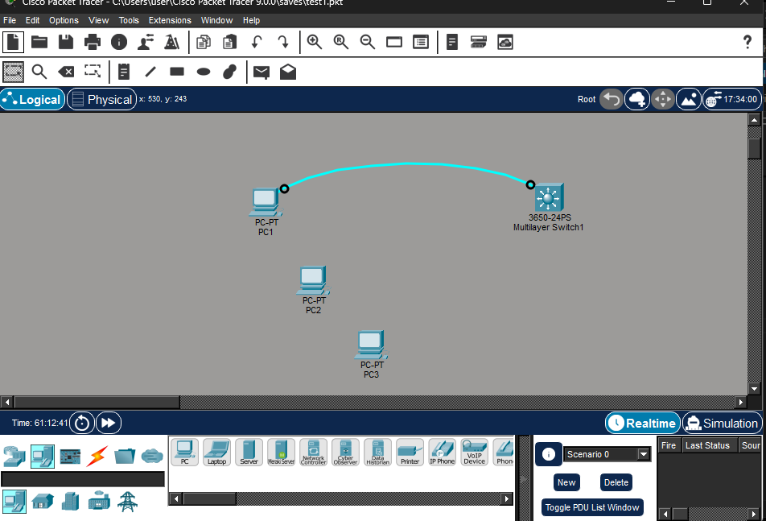

デバイス種類選択ボックス1段目の左から4番目の[connection]を左クリックし、2段目の一番左を左クリックする。


デバイス選択ボックスの左から3番目のアイコンを左クリックする。

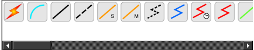

追加したパソコンを左クリックすると次のようなメニューがポップアップするので[FastEthernet]を左クリックする。

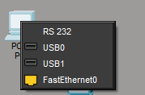

そして、スイッチを左クリックし、スイッチ側は[GigabitEthernet1/0/1]を左クリックする。

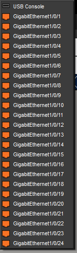

同様な手順で、3つ目のパソコンは[GigabitEthernet1/0/2]と接続する。

最終的には次のようになっている。

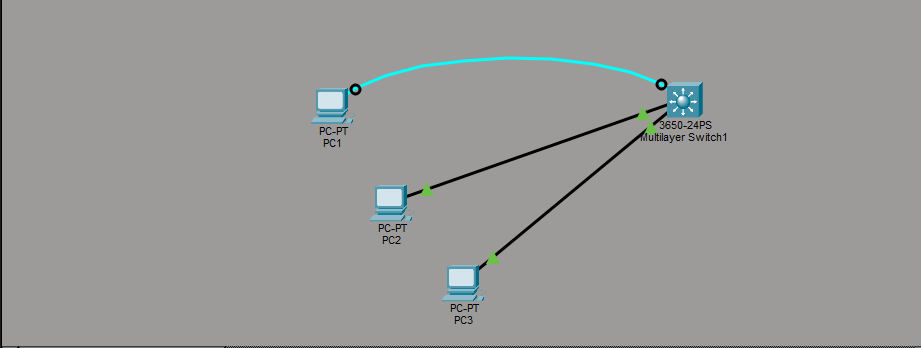

## パソコンの設定をする
スイッチの[1/0/1]インターフェイスにつながっているパソコンを左クリックする。そうすると次のようなウィンドウがポップアップされる。

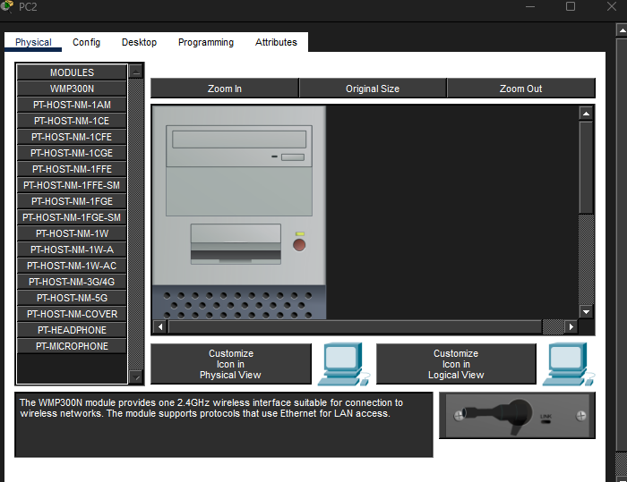

[desktop]タブを左クリックし[IP Configuration]アイコンを左クリックする。

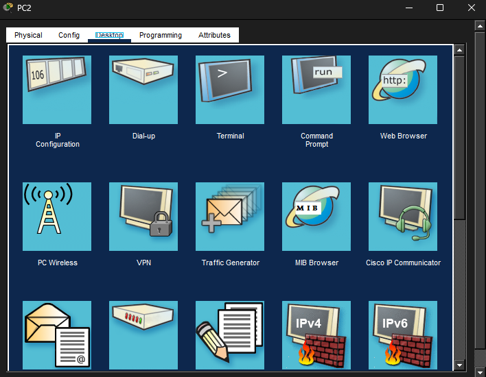

そうすると次のような画面に切り替わる。

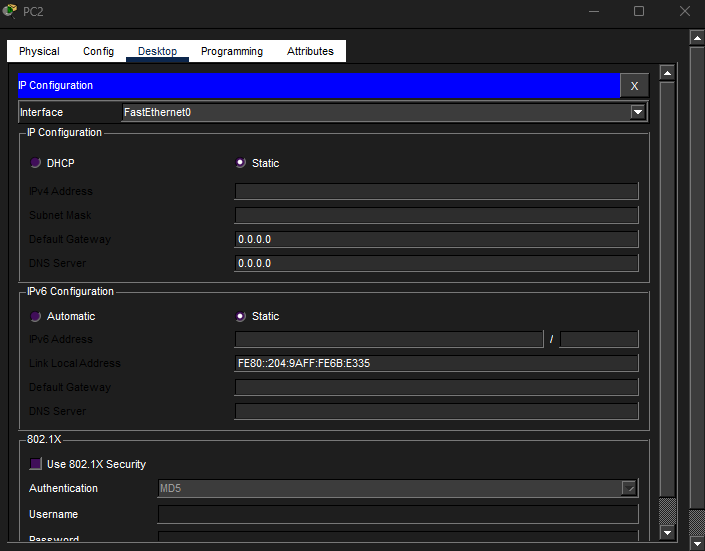

[Static]が選択されていること確認し、[IPv4 Address]を[172.1.1.1]に、[Subnet Mask]を[255.255.255.0]に、[Default Gateway]を[172.1.1.254]に設定する。

再度[desktop]タブを左クリックし、今度は[Command Prompt]を左クリックする。
[ipconfig]を実行し、アドレスを確認する。
```
C:\>ipconfig

FastEthernet0 Connection:(default port)

   Connection-specific DNS Suffix..: 
   Link-local IPv6 Address.........: FE80::204:9AFF:FE6B:E335
   IPv6 Address....................: ::
   IPv4 Address....................: 172.1.1.1
   Subnet Mask.....................: 255.255.255.0
   Default Gateway.................: ::
                                     172.1.1.254

Bluetooth Connection:

   Connection-specific DNS Suffix..: 
   Link-local IPv6 Address.........: ::
   IPv6 Address....................: ::
   IPv4 Address....................: 0.0.0.0
   Subnet Mask.....................: 0.0.0.0
   Default Gateway.................: ::
                                     0.0.0.0
```
